# ELK Windows PowerShell Detection Lab

## Project Overview

This project demonstrates how the Elastic Stack (ELK) can be used as a
Security Information and Event Management (SIEM) platform to monitor,
detect, and investigate Windows PowerShell activity.

The lab simulates common PowerShell techniques used by attackers,
collects endpoint telemetry using Sysmon and Winlogbeat,
and analyzes the generated events in Kibana.

The objective is to demonstrate practical SOC analyst skills,
including threat hunting, log analysis,
endpoint monitoring,
and detection engineering.

---

# Project Objectives

- Simulate common Windows PowerShell attack techniques.
- Collect Windows Event Logs using Winlogbeat.
- Generate detailed endpoint telemetry with Sysmon.
- Ingest security events into Elasticsearch.
- Investigate PowerShell activity using Kibana Discover.
- Demonstrate attacker process relationships.
- Perform threat hunting using Kibana queries.
- Validate detection of suspicious PowerShell behavior.

---

# Lab Architecture

Windows 11 Endpoint

↓

Sysmon

↓

Windows Event Logs

↓

Winlogbeat

↓

Elasticsearch

↓

Kibana Discover

---

# Technologies Used

- Elastic Stack (ELK)
- Elasticsearch
- Kibana
- Winlogbeat
- Sysmon
- Windows 11
- Windows PowerShell
- Sysinternals Sysmon
- YAML Configuration

---

# Attack Simulation

The following Windows PowerShell activities were executed during the lab.

## Windows Discovery Commands

- whoami
- hostname
- ipconfig

Purpose

Simulates attacker reconnaissance after initial access.

---

## User Enumeration

Command

net user

Purpose

Enumerates local user accounts.

Mapped MITRE ATT&CK

T1087.001
Account Discovery

---

## Encoded PowerShell Execution

Command

powershell -enc <Base64 Encoded Command>

Purpose

Simulates obfuscated PowerShell execution commonly used by malware.

Mapped MITRE ATT&CK

T1027
Obfuscated Files or Information

T1059.001
PowerShell

---

## Execution Policy Bypass

Command

powershell -ExecutionPolicy Bypass -Command "Get-Process"

Purpose

Demulates bypassing PowerShell execution restrictions.

Mapped MITRE ATT&CK

T1059.001
PowerShell

---

## Privilege Escalation Attempt

Command

Start-Process powershell -Verb RunAs

Purpose

Attempts to launch an elevated PowerShell process.

Mapped MITRE ATT&CK

T1548
Abuse Elevation Control Mechanism

---

## Child Process Creation

Command

notepad

Executed from PowerShell.

Purpose

Demonstrates parent-child process relationships.

Mapped MITRE ATT&CK

T1059.001
PowerShell

---

# Kibana Detection Queries

The following searches were used during investigation.

### PowerShell Processes

```
process.name:"powershell.exe"
```

---

### Encoded PowerShell

```
process.command_line:*enc*
```

---

### PowerShell Execution Policy Bypass

```
message:*ExecutionPolicy*
```

---

### User Enumeration

```
message:*net user*
```

---

### Privilege Escalation

```
message:*RunAs*
```

---

### Notepad Process

```
process.executable:*Notepad*
```

---

### Parent Child Relationship

```
process.parent.name:powershell.exe
```

---

# Detection Results

The Elastic Stack successfully detected:

- Windows discovery commands
- Local user enumeration
- Encoded PowerShell execution
- PowerShell ExecutionPolicy Bypass
- Privilege escalation attempts
- Parent-child process creation
- PowerShell process execution
- Sysmon Process Create events

| Technique               | MITRE ATT&CK | Detection                            |
| ----------------------- | ------------ | ------------------------------------ |
| Encoded PowerShell      | T1059.001    | `process.command_line:*enc*`         |
| Execution Policy Bypass | T1059.001    | `ExecutionPolicy Bypass`             |
| User Enumeration        | T1087        | `message:*net user*`                 |
| RunAs                   | T1548        | `message:*RunAs*`                    |
| Process Creation        | T1059        | `process.parent.name:powershell.exe` |

---

# Screenshots

---

## 01 Windows Discovery Commands

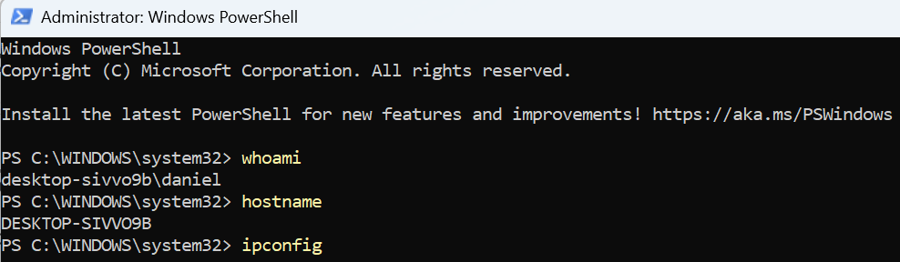

---

## 02 User Enumeration

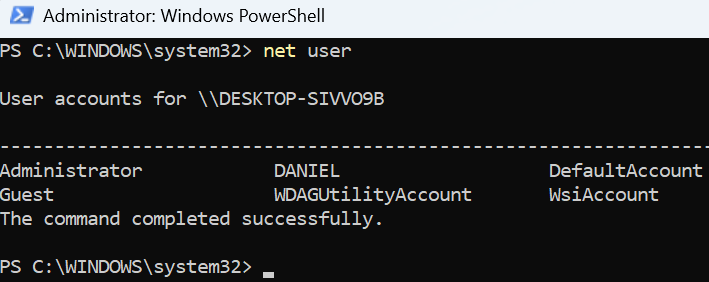

---

## 03 Encoded PowerShell Execution

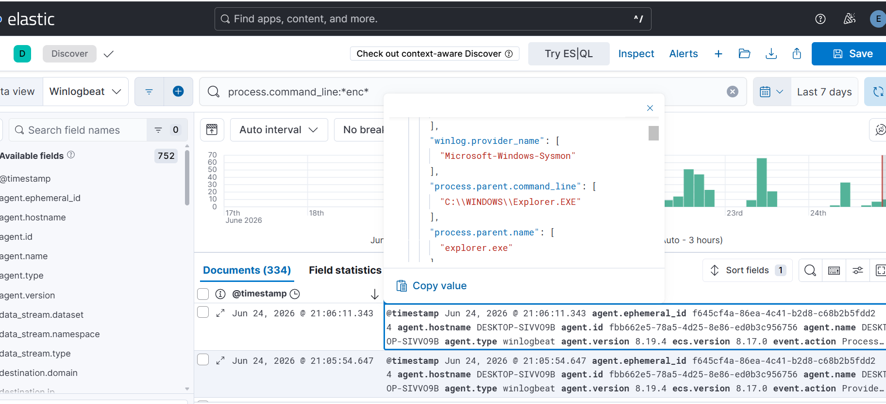

---

## 04 PowerShell ExecutionPolicy Bypass

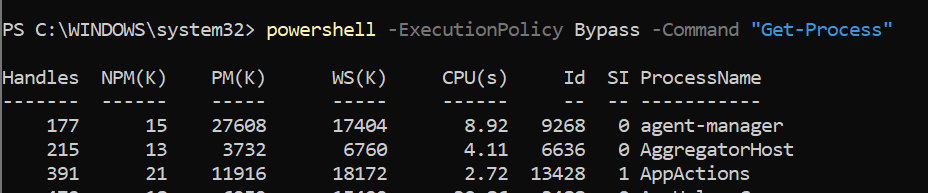

---

## 05 RunAs Privilege Escalation

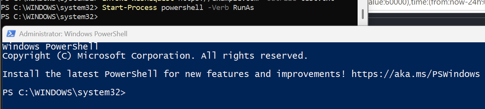

---

## 06 PowerShell Creates Notepad

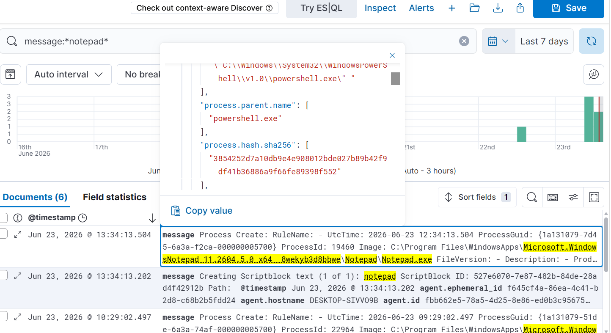

---

## 07 Kibana Detection – PowerShell Process

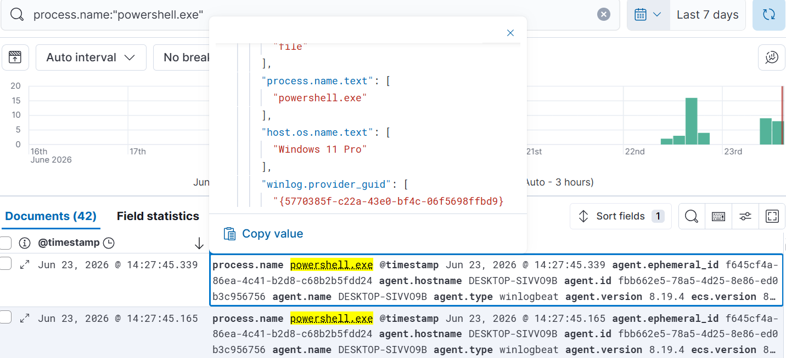

---

## 08 Kibana Detection – Encoded PowerShell

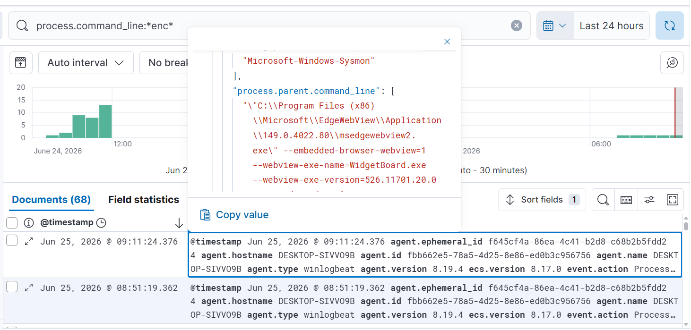

---

## 09 Kibana Detection – RunAs

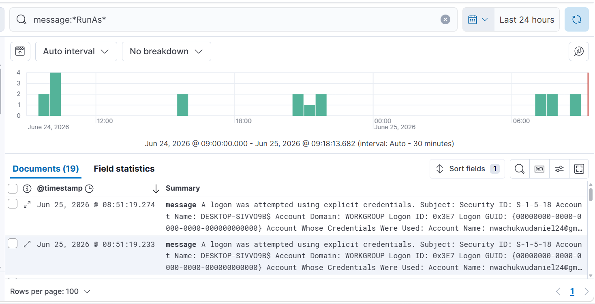

---

## 10 Kibana Detection – Notepad Process

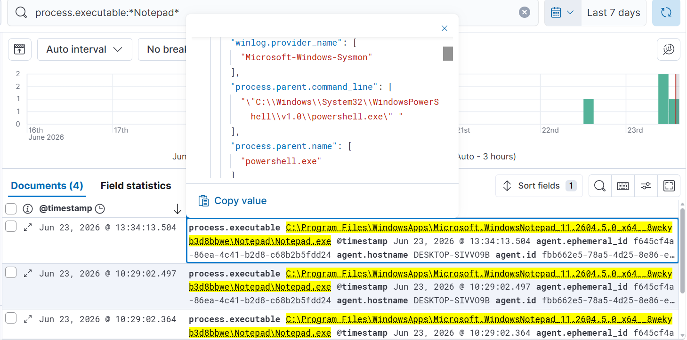

---

## 11 Parent–Child Process Relationship

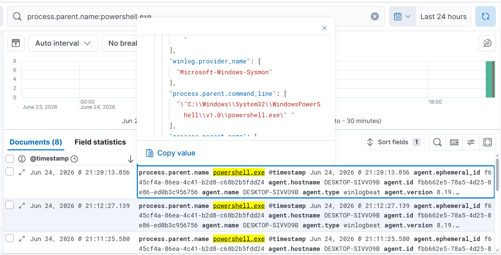

---

# Skills Demonstrated

- Security Monitoring
- Threat Hunting
- SIEM Investigation
- Detection Engineering
- Log Analysis
- Windows Event Analysis
- Sysmon Configuration
- Winlogbeat Deployment
- Elasticsearch
- Kibana
- PowerShell Monitoring
- MITRE ATT&CK Mapping

---

# MITRE ATT&CK Techniques

| Technique | Description |
|-----------|-------------|
| T1059.001 | PowerShell |
| T1027 | Obfuscated Files or Information |
| T1087.001 | Local Account Discovery |
| T1548 | Abuse Elevation Control Mechanism |

---

# Learning Outcomes

This project demonstrates how defenders can use Elastic Stack,
Sysmon,
and Winlogbeat
to detect suspicious PowerShell activity,
perform threat hunting,
analyze endpoint telemetry,
and investigate attacker behavior using real Windows event logs.

---

# Author

**Daniel Nwachukwu**

SOC Analyst

Threat Detection • SIEM Engineering • Incident Response

LinkedIn:
https://www.linkedin.com/in/daniel-nwachukwu-36b711132/

GitHub:
https://github.com/Danielnwachukwu
